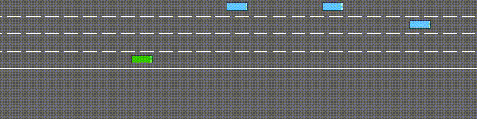
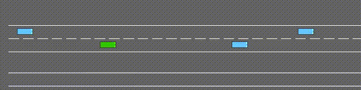
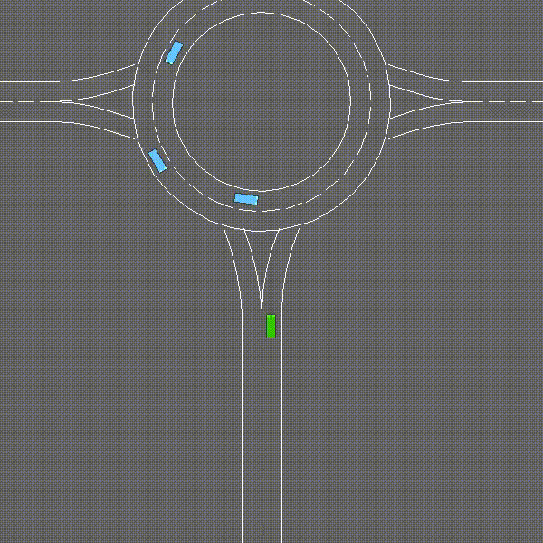

<div align="center">

# Multi-Environment Decision Making
### Deep Reinforcement Learning for Autonomous Driving

[](https://python.org)
[](https://pytorch.org)
[](https://gymnasium.farama.org)
[](LICENSE)

**A single RL agent that learns to drive across multiple road environments simultaneously — Highway, Merge lanes, and Roundabouts — using a shared perception encoder with environment-specific decision heads.**

[Overview](#-overview) • [Architecture](#-architecture) • [Environments](#-environments) • [Algorithms](#-algorithms) • [Installation](#-installation) • [Usage](#-usage) • [Results](#-results)

</div>

---

## Demo

<div align="center">

| Highway-v0 | Merge-v0 | Roundabout-v0 |
|:-----------:|:--------:|:-------------:|
|  |  |  |
| Drive fast, stay in lane | Merge into moving traffic | Navigate a circular junction |

</div>

---

## Overview

Most autonomous driving research trains a **separate model per scenario**. This project takes a different approach — train one agent across all environments at once.

At every episode reset, the environment is chosen at random (Highway, Merge, or Roundabout). The agent must adapt and perform well on all three. This forces it to learn **transferable driving skills** rather than memorizing one road layout.

**Key highlights:**
- Single model — 3 environments, zero task-switching overhead
- Shared encoder captures universal road perception
- Per-environment Q-heads handle scenario-specific decision making
- Supports 4 RL algorithm variants: DQN, DDQN, Dueling DQN, PER

---

## Architecture

```
  Input: Observation (5 nearby vehicles × 5 features = 25 values)
         │
         ▼
  ┌──────────────────────────────────────────┐
  │               ENCODER                    │
  │   Linear(25→256) → LayerNorm → ReLU      │  ← Shared across ALL environments
  │   → Linear(256→256) → LayerNorm → ReLU   │    Learns universal road features
  └─────────────────────┬────────────────────┘
                        │   256-dim embedding
          ┌─────────────┼──────────────┐
          ▼             ▼              ▼
   ┌────────────┐ ┌────────────┐ ┌────────────┐
   │ Highway    │ │ Merge      │ │ Roundabout │  ← Separate Q-head per environment
   │  Q-head    │ │  Q-head    │ │  Q-head    │    Learns scenario-specific policy
   └─────┬──────┘ └─────┬──────┘ └─────┬──────┘
         └──────────────┼──────────────┘
                        ▼
              5 Q-values (one per action)
              → argmax → chosen action
```

### Double Q-Learning (Anti-Overestimation)

```
  ┌────────────────────┐         ┌────────────────────────┐
  │   Critic Network   │         │    Target Network       │
  │   Updates every    │         │    Updates every        │
  │   training step    │         │    50 steps (slowly)    │
  └────────┬───────────┘         └────────────┬───────────┘
           │                                   │
           │  "Which action is best?"          │  "How much is that action worth?"
           └──────────────────┬────────────────┘
                              ▼
                  Decoupled selection + evaluation
                  → Eliminates overestimation bias
                  → Stable, reliable learning
```

### Dueling Architecture (Optional)

```
  Standard Q-head:           Dueling Q-head:
  ─────────────────          ────────────────────────────────────
  Linear → Q(s,a)            Linear → V(s)       (state value)
                              Linear → A(s,a)    (action advantage)
                              Q(s,a) = V(s) + A(s,a) − mean(A)
```

---

## Environments

All environments are powered by the [highway-env](https://github.com/Farama-Foundation/HighwayEnv) library.

### Observation Space — 5×5 Matrix

```
Row 0 (ego car):  [ present,  x,  y,  vx,  vy ]
Row 1 (car 1):    [ present,  x,  y,  vx,  vy ]
Row 2 (car 2):    [ present,  x,  y,  vx,  vy ]
Row 3 (car 3):    [ present,  x,  y,  vx,  vy ]
Row 4 (car 4):    [ present,  x,  y,  vx,  vy ]
```

### Action Space — 5 Discrete Actions

| ID | Action |
|----|--------|
| `0` | Lane change LEFT |
| `1` | IDLE — maintain speed and lane |
| `2` | Lane change RIGHT |
| `3` | FASTER — accelerate |
| `4` | SLOWER — decelerate |

### Environment Details

| Environment | Objective | Duration | Reward Signals |
|-------------|-----------|----------|---------------|
| `highway-v0` | Drive fast, stay in right lane | 40 steps | Speed `+0.4` · Right lane `+0.1` · Crash `-1.0` |
| `merge-v0` | Safely merge into highway traffic | Variable | Speed `+0.2` · Merge penalty `-0.5` · Crash `-1.0` |
| `roundabout-v0` | Navigate roundabout without collision | 11 steps | Speed `+0.2` · Lane change `-0.05` · Crash `-1.0` |
| `intersection-v0` | Cross intersection efficiently | 13 steps | Arrived `+1.0` · Speed `+2.0` · Crash `-5.0` |

---

## Algorithms

Four variants are implemented, progressively improving upon each other:

### DQN — Deep Q-Network (Baseline)

A neural network that approximates Q(s, a) — the expected cumulative reward for action `a` in state `s`.

```
Loss = [ r  +  γ · max_a Q_target(s', a)  −  Q(s, a) ]²
         ↑              ↑                       ↑
     reward       future value             prediction
```

### DDQN — Double DQN *(Default)*

Solves DQN's overestimation problem by decoupling action selection from value estimation:

```
DQN:   target = r + γ · Q_target( s', argmax_a Q_target(s', a) )   ← same network → biased
DDQN:  target = r + γ · Q_target( s', argmax_a Q_critic(s', a)  )   ← two networks → unbiased
```

### Dueling DQN

Decomposes Q-values into state value V(s) and action advantage A(s,a):

```
Q(s, a) = V(s) + A(s, a) − mean( A(s, ·) )
```

The network learns **which states are dangerous** separately from **which actions are best** — more efficient learning, especially when many actions lead to similar outcomes.

### Prioritized Experience Replay (PER)

Instead of sampling replay memory uniformly, prioritizes experiences with high TD-error:

```
High TD-error → agent was surprised → sample more often → learn faster
Low TD-error  → agent already knew  → sample less often → avoid wasted steps
```

Uses a **Segment Tree** (O log N) for efficient priority-based sampling.

### Multi-Step Returns (n=10)

Instead of bootstrapping just 1 step ahead, looks 10 steps forward:

```
1-step  return:  r₁  +  γ · V(s₁)
10-step return:  r₁  +  γr₂  +  γ²r₃  +  ···  +  γ⁹r₁₀  +  γ¹⁰ · V(s₁₀)
```

Better long-horizon credit assignment — the agent learns the downstream consequences of its decisions.

---

## Project Structure

```
Multi-Env-Decision-Making/
│
├── run.py                        # Entry point — CLI for train / test modes
├── train.py                      # Trainer class — full training loop
├── evaluate.py                   # Evaluator class — policy evaluation
├── highway.py                    # HighwayEnv wrapper — multi-env management
├── video.py                      # VideoRecorder — MP4 episode recording
├── logger.py                     # Logger — CSV + TensorBoard metrics
├── utils.py                      # Utilities — MLP builder, soft update, seed
├── config.yaml                   # Main config — DDQN on all 3 environments
├── run.sh                        # Bash shortcuts for common commands
├── requirements.txt              # Python dependencies
│
├── policy/
│   ├── agent.py                  # Core RL: Encoder + Critic + DRQLAgent
│   ├── replay_buffer.py          # ReplayBuffer + PrioritizedReplayBuffer
│   └── segment_tree.py           # SumSegmentTree + MinSegmentTree (for PER)
│
├── configurations/               # Experiment presets
│   ├── dqn/                      # Standard DQN (single & multi-env)
│   ├── ddqn/                     # Double DQN variants
│   ├── dueling/                  # Dueling DQN variants
│   ├── prioritized_replay/       # PER variants
│   ├── hidden_units_128_256/     # Small network ablation
│   └── hidden_units_256_512/     # Large network ablation
│
├── env_configs/                  # Per-environment reward shaping
│   ├── highway-v0.yaml
│   ├── merge-v0.yaml
│   ├── roundabout-v0.yaml
│   └── intersection-v0.yaml
│
├── experiments/                  # Auto-created — saved models & logs
└── media/                        # Demo GIFs
```

---

## Installation

```bash
# 1. Clone the repository
git clone https://github.com/PalliGayathri/Multi-Env-Decision-Making.git
cd Multi-Env-Decision-Making

# 2. Create and activate a virtual environment
python -m venv .venv
source .venv/bin/activate        # macOS / Linux
# .venv\Scripts\activate         # Windows

# 3. Install dependencies
pip install -r requirements.txt
pip install moviepy              # Required for video recording
```

**System requirements:**

| Requirement | Minimum |
|-------------|---------|
| Python | 3.10+ |
| PyTorch | 2.0+ |
| gymnasium | 1.x |
| highway-env | 1.10+ |
| RAM | 4 GB |
| GPU | Optional (CPU works fine) |

---

## Usage

### Train the Agent

```bash
# Train on all 3 environments (Highway + Merge + Roundabout) — recommended
python run.py --config config.yaml

# Train on a single environment
python run.py --config configurations/ddqn/ddqn_highway.yaml

# Train with Dueling DQN + PER
python run.py --config configurations/dueling/dueling_highway_merge_roundabout.yaml
```

Output is saved automatically to `experiments/<experiment_name>/`.

### Test a Trained Model

```bash
# Evaluate — prints mean and max reward
python run.py --config config.yaml -m test -p experiments/ddqn/ddqn.pt

# Evaluate + record video
python run.py --config config.yaml -m test -p experiments/ddqn/ddqn.pt --render_video
```

### Monitor with TensorBoard

```bash
tensorboard --logdir experiments/
# → Open http://localhost:6006
```

### Bash Shortcuts

```bash
bash run.sh train                                   # train on all environments
bash run.sh train-highway                           # train on highway only
bash run.sh train-merge                             # train on merge only
bash run.sh train-roundabout                        # train on roundabout only
bash run.sh test experiments/ddqn/ddqn.pt          # evaluate a model
bash run.sh test-video experiments/ddqn/ddqn.pt    # evaluate with video
bash run.sh tensorboard                             # open tensorboard
```

---

## Configuration

```yaml
experiment_name: ddqn

# ── Training ─────────────────────────────────────────
num_train_steps: 60000       # Total environment steps
num_eval_steps: 1000         # Steps per evaluation run
eval_frequency: 1500         # Evaluate every N steps

# ── Memory ───────────────────────────────────────────
replay_buffer_capacity: 45000  # Max stored experiences
batch_size: 32                 # Samples per gradient update
multistep_return: 10           # N-step return horizon

# ── Agent ────────────────────────────────────────────
agent:
  learning_rate: 0.0005        # Adam optimizer learning rate
  discount: 0.8                # Future reward discount (γ)
  double_q: true               # Enable Double Q-learning
  prioritized_replay: false    # Enable Prioritized Experience Replay
  critic_tau: 1.0              # Target update weight (1.0 = hard copy)
  critic_target_update_frequency: 50  # Steps between target updates

# ── Network Architecture ─────────────────────────────
critic:
  hidden_dim: 256              # Q-network hidden size
  dueling: false               # Enable Dueling architecture

encoder:
  hidden_dim: 256              # Encoder hidden size

# ── Environments ─────────────────────────────────────
environments: highway-v0, merge-v0, roundabout-v0
```

---

## Reading Training Output

```
| train | E: 38 | S: 867 | R: 31.5 | FPS: 2.9 | BR: 3.9 | CLOSS: 0.27
```

| Column | Meaning | Goal |
|--------|---------|------|
| `E` | Episode number | — |
| `S` | Total steps taken | — |
| `R` | Episode reward | **Higher is better** |
| `FPS` | Training speed (frames/sec) | — |
| `BR` | Average reward in batch | — |
| `CLOSS` | Critic loss (prediction error) | **Lower is better** |

---

## Results

DDQN trained across all 3 environments for 60,000 steps:

| Phase | Episode | Steps | Reward | Critic Loss | Behaviour |
|-------|---------|-------|--------|-------------|-----------|
| Early | E:6 | ~120 | ~6–20 | 2.70 | Random, frequent crashes |
| Learning | E:25 | ~400 | ~29–31 | 0.33 | Emerging safe driving |
| Converged | E:60 | ~1700 | ~29–31 | 0.20 | Consistent, smooth driving |

**Evaluation at step 1000:** Reward = **28.8** — agent generalizes to unseen episodes, not memorizing.

> Reward jumped from ~6 → ~30 within the first 400 training steps. Critic loss dropped 10× from start to convergence.

---

## Key Concepts

<details>
<summary><b>Why multi-environment training?</b></summary>

Training on a single environment causes the agent to memorize that road's patterns. By randomly sampling environments each episode, the agent is forced to learn general driving intuitions that transfer across scenarios — similar to how a human driver adapts to new roads.

</details>

<details>
<summary><b>Why shared encoder + separate Q-heads?</b></summary>

- **Shared encoder** — detecting a nearby car and estimating its speed is the same perceptual task regardless of road type. Sharing weights here improves data efficiency.
- **Separate Q-heads** — the optimal response to a car on your left is completely different on a highway vs a roundabout. Per-environment heads allow specialization without sacrificing shared perception.

</details>

<details>
<summary><b>Why experience replay?</b></summary>

Neural networks assume training samples are i.i.d. (independent and identically distributed). Consecutive frames in a driving episode are highly correlated — using them directly would cause unstable training. Storing all experiences in a replay buffer and sampling randomly breaks this correlation.

</details>

<details>
<summary><b>Why epsilon-greedy exploration?</b></summary>

```
Start: ε = 0.95 → 95% random  (explore unknown situations)
 ...    ε decays linearly
  End: ε = 0.05 →  5% random  (exploit learned knowledge)
```

Early training needs randomness to discover good strategies. Later, the agent should mostly use what it learned while still exploring occasionally to avoid getting stuck.

</details>

---

## Dependencies

| Package | Version | Purpose |
|---------|---------|---------|
| `torch` | ≥2.0 | Neural network training and inference |
| `gymnasium` | ≥1.0 | RL environment interface |
| `highway-env` | ≥1.10 | Driving simulation environments |
| `tensorboard` | latest | Training metrics visualization |
| `numpy` | ≥1.24 | Numerical array operations |
| `imageio` + `moviepy` | latest | Episode video recording |
| `PyYAML` | latest | Config file parsing |
| `matplotlib` | latest | Plotting utilities |

---

## Author

<div align="center">

**Palli Gayathri**
*Machine Learning Engineer*

[](https://github.com/PalliGayathri)
[](https://www.linkedin.com/in/palli-gayathri-1a5105384/)
[](mailto:bapujipalli452@gmail.com)

</div>

---

## Acknowledgements

- Driving environments by [highway-env](https://github.com/Farama-Foundation/HighwayEnv) — Farama Foundation
- Architecture influenced by [CURL](https://github.com/MishaLaskin/curl) and DrQ

---

<div align="center">

*If you found this project useful, consider giving it a ⭐ on GitHub!*

</div>
